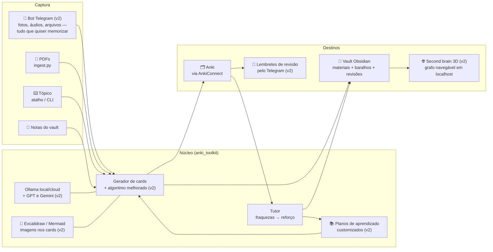

# Anki Toolkit — de templates a tutor pessoal de estudo

Começou como três note types com tema de terminal; hoje é um toolkit completo:
gera flashcards com IA (Ollama local/cloud), ingere PDFs, adiciona direto no
Anki, guarda tudo no Obsidian, narra vocabulário de inglês com voz nativa e
tem um tutor que lê seu histórico de revisões e ataca seus pontos fracos.

## O que já funciona (v1 — roadmap 100% concluído)

| Comando | O que faz |
|---|---|
| `card_agent.py --topic "..." --push` | Gera cards com IA e adiciona direto no Anki aberto (fallback `.apkg`) |
| `card_agent.py --file material.md --push --vault` | Cards a partir de material + nota de estudo no Obsidian |
| `card_agent.py --topic "..." --audio --push` | Vocabulário de inglês com MP3 de voz neural nativa (edge-tts) |
| `ingest.py apostila.pdf --vault` | PDF → markdown limpo (digital, OCR em GPU ou multimodal) |
| `tutor.py relatorio --vault` | Diagnóstico de fraquezas (lapsos/ease) no terminal e no Obsidian |
| `tutor.py reforcar --deck "X" --push` | Cards novos reformulados dos temas que você mais erra |
| `tutor.py explicar "busca"` | Explica um card: porquê, exemplo novo e macete |
| `build_templates.py --push` | Regenera os templates (fonte única `templates/tokenizer.js`) e atualiza no Anki |
| Atalho **"Novo baralho Anki"** | Área de trabalho: digita o tópico → cards no Anki, sem terminal |

Detalhes de uso e flags: **[AGENTE.md](AGENTE.md)**. Decisões de arquitetura e
histórico das fases: **[ROADMAP.md](ROADMAP.md)**.

5 + 1 note types (IDs fixos — reimportar atualiza sem duplicar): Terminal
Cloze, Digite o Código, Digite a Saída (com realce Python/JS/Bash/PowerShell),
Q&A, Cloze e Inglês — Vocabulário (2 cartões: reconhecimento + produção).

```
anki_toolkit/     núcleo (models, llm, outputs, bridge, ingest, vault, tts, tutor)
templates/        tokenizer.js — fonte única do realce dos templates
1..3-*/           HTML dos note types de terminal (gerados por build_templates.py)
tools/            ollama_worker.py (orquestração) + novo_baralho.ps1 (atalho)
tests/            117 testes pytest + 7 testes Node do tokenizer
```

## Visão geral e próximas melhorias (v2)



### Backlog da v2 (em ordem provável)

1. **Bot do Telegram — captura universal.** Mandar foto (OCR), áudio
   (transcrição), arquivo ou texto para o bot → vira cards e entra no Anki
   sozinho. É a captura no momento em que a dúvida aparece, do celular.
2. **Lembretes de revisão pelo Telegram.** O tutor avisa quando há cards
   vencendo e manda o resumo semanal de fraquezas (fecha o ciclo fora do PC).
3. **Diagramas nos cards — Mermaid e Excalidraw.** O gerador produz a
   definição do diagrama (fluxo, mapa mental, esquema) e a imagem renderizada
   entra como media do card. Memória visual para processos e arquiteturas.
4. **Second brain 3D em localhost.** Página HTML que monta o grafo
   Obsidian + Anki (materiais ↔ baralhos ↔ cards ↔ revisões) com navegação 3D
   (force-graph). A diferença para os da moda: cada nó carrega dados REAIS de
   aprendizado (retenção, lapsos) — não é só estética de YouTube.
5. **Algoritmo de geração melhor.** Auto-crítica do modelo (gera → revisa →
   corrige), deduplicação semântica contra a coleção existente e calibração
   de dificuldade pelos princípios de Woźniak medidos no seu histórico.
6. **Planos de aprendizado customizados.** Dado um objetivo ("aprender X em
   N semanas"), o pipeline monta o plano: sequência de materiais, decks por
   etapa e metas de revisão — explorando as técnicas com melhor retorno
   comprovado no SEU histórico (interleaving, recall ativo, espaçamento).
7. **Outros provedores de modelo.** Camada de provedor no `llm.py` para
   plugar GPT e Gemini além do Ollama (a interface já é um ponto único).

## Instalação rápida

```powershell
python -m venv .venv
.\.venv\Scripts\python.exe -m pip install -r requirements.txt      # núcleo (genanki)
.\.venv\Scripts\python.exe -m pip install -r requirements-tts.txt  # áudio (opcional)
.\.venv\Scripts\python.exe -m pip install -r requirements-ingest.txt  # PDFs (opcional)
```

Pré-requisitos: [Ollama](https://ollama.com) rodando (`ollama serve`) e, para
`--push`/tutor, o Anki aberto com o addon **AnkiConnect** (código `2055492159`).

## Templates de terminal (instalação manual, sem o toolkit)

Os note types de código usam tema de terminal escuro (One Dark) e comparação
de digitação **nativa** do Anki (`{{type:...}}`).

1. Anki → **Ferramentas → Gerenciar tipos de nota → Adicionar**
   (Template 1: base **Cloze**; 2 e 3: base **Básico (digite a resposta)**).
2. Selecione o note type → **Cartões…** e cole `front.html`, `back.html` e
   `styling-comum.css` de cada pasta.
3. Campos: **1)** `Front`, `Back` · **2)** `Pergunta`, `Codigo`, `Notas` ·
   **3)** `Codigo`, `Saida`, `Notas` (nomes exatos).

> Mais fácil: importe `python-templates.apkg`, que cria os 6 note types
> prontos — ou simplesmente use `--push`, que cria o que faltar sozinho.

O `{{type:...}}` compara caractere a caractere — ideal para respostas curtas.
Para blocos longos de código, prefira o template 1 (cloze).
